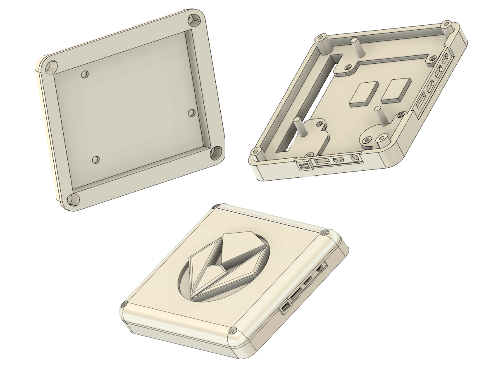

# Display recycling project

## About the project

This Repo explains the full process of how I learned 3D printing in order to give new life to an otherwise for parts only display. There were 2 generations, Generation 1 and it's contents have all the models for the first version I had created. Both carried the same idea with generation 2 obviously being an upgrade of the first. This was a simple design using both acrylic and 3d printing to create a thin and flat enclosure so it can be portable and still usable. The first generation was good but not quite at the level I had hoped to achieve. Therefore the redesign was started with generation 2, build learning from the mistakes I had made with generation 1. So that I could finally have the case I wanted to have all along something simple to install utilizing the original housing of the display. But also in a way that has minimal influence on the original housing. Otherwise this repo also contains all object files, 3MF's (but do beware the measurements are incorrect) and STL this is in case you wish to either edit, print or view the files on the repo. Also in the folder Fusioncode is a pythonscript that was made to export the files from the cloud back to the local disk for backing up.

## Generation 1

## Material and methods

This project started when I was watching the video from [DIY Perks](https://www.youtube.com/watch?v=DrqdHVeBkp4). I was at the time impressed by the project and when I recieved the broken laptop display assembly I knew what had to be done. So fist part was discovering how it all would work, luckily the video explains this quite well so I will only recap the most important parts. The first step is to discover the display model number, this will allow is to find the correct driver board on ebay or make it if it does not exist. For me the display was the following number: **B133HAN04.B**, I was able to find this by checking all the stickers on the back on the [Panelook](https://www.panelook.com/) and seeing if they resulted into a match. That result gave me a few options to buy from from Ebay and after a order and a bit of waiting later all parts arrived safely I connected it all and tested if the display was still operational. 

**The display works now what?**

Well now that the display works the next step is to open up Fusion 360 and start designing and thinking of how the case should work. The main question that arose was how would I mount the board in a way that would have it stay inside the print? So a lot of measuring came into play this was to make sure that the placement of the screws was correct. Which ended up being incredibly challenging and since I did not own a 3D printed and wished the project to be done I chose to drill the holes through my print and make a simple rectangle for the IO since prototyping would be difficult. The screws ended up being plastic ones because they fit best inside the PCB and were non conductive so it would not be difficult to create a possible short. Then a simple acrylic panel was used as a lid to close the case up. This has some rectangular holes which theoretically would be used to loop a usb-c or mini hdmi cable so it would all be nice into one package (with ofc a big enough case with extra space to house the cable). 

Finally it was time for the most important part the system to keep the display setup at an angle so it remains stationary and easily adjustable. The original idea was to make hinges with screws since adjustments are easy and it would be easy to replicate. Then attached to those hinges are the legs with in the middle another alternative hinge. This middle hinge has another hinge on top of it which can be used to set a magnet head so the magnet always stays flat on the metal and so that adjustment is as simple as moving the magnet up or down. (This is a inbetween sidenote these choices were made with not a little to no experience with 3D printing and I did not have one available. I also was unaware of the practices I know now at the time of writing). With all of this done it was time to get on to the next step assembly of the case, board and the displayassembly. 

To start the assembly the display the display connector had to be found and then accurately cut so there is a passthrough for the cable to get to the back of the assembly. The print will help with this alignment since it also need a passthrough hole for the display cable making sure the cable is oriented in the correct way, this is so it can go back into the display driver PCB. Now that the cable is through the display assembly and slotted safely into the PCB driver board can be mounted inside the case near the rectangle so that drilling holes can be placed (making sure the driver board aligns well with the rectangular hole for the cable to pass through do the same for the input board). Once all the holes are made through the 3D case the screws can be inputted through the back so they stick out of the case so that screws match the PCB holes. Now the other screws to secure the acrylic can be placed with the screw head on the back of the display assembly. Then place a layer of glue on the display assembly and carefully align the 3D print with the display assembly case. Now it is best to have something to hold both together until the glue is fully dried. For the acrylic there is a small aluminum plate that can be attached to the acrylic so that the magnet has a place to be installed. Also on the acrylic the two hinge prints can be place through the squares and then glued in. Once that is done the rest of the assembly can be mounted on using several screws, bolts and nuts. Until the final assembly shown as above is done.

## Reflection of Generation 1

Well though the design seemed to be very well after some time of using this design there were a few flaws. Firstly the height of the cable inputs from the board did not have a sufficient distance to allow cables to be plugged in. Very few cables would work but it is way to narrow to allow every cable to work. Secondly there is the display adjustment system. The magnets did not quite hold as well as I had hoped which caused it to slide away and since the entire project did not have anything that kept it from sliding away. Which ended up making the assembly in it's entirety not incredibly usefull. Another problem was the acrylic bending, in the original design there were no standoffs in mind and due to the large empty area in the middle the acrylic flexed and this causes the acrylic to move and then also break off on the sides. As well as many more issues, in summary a redesign was needed in order to make it a useful product. 

# Generation 2

The first change to make this newer generation was to make it all fit in one module. As well as further research on the board itself which can be found [here](research/Displayboardresearch.md). Outside of that a small investment was made for a [Bambulab X1C](https://eu.store.bambulab.com/products/x1-carbon?id=596569521729064967) printer with the [Bambulab AMS](https://eu.store.bambulab.com/products/ams-multicolor-printing?from=navigation), this allowed for faster prototyping because before the way prototyping was done was by going to the nearest makerspace waiting for the print to complete just so that it was apparent there is an issue causing me to go back. So the new design begins! Firstly the decision had to be made to modify the original object file or to start completely anew. Which was quickly made due to the many issues mentioned before to start anew. First thing is to reflect on what was wrong/missing on the previous iteration, what was already working and could be reused and how shall the redesign work now. 

Firstly distance the screw holes and distance between the boards, as mentioned before. To do this measurements were taken so that the screws will properly fit, To make sure this was the case this was this was also the start. I measured the places of the screws as well as the input ports so that it will be a snug fit. After a few redesigns both for the main [PCB](Generation2/boardholder.stl) and the [control board](Generation2/controllerboardwithinterface.stl) (which the stl's can be found for by clicking the links) this was finally done. After that it came time to figure out a way to put both together in one case in which the flex cables do not entangle either with themselves or the case, all of this whilst also keeping it as one singular unit. After about 40 prototypes this was finally achieved (again this entire project was my first experience having and 3D printing) learning a lot about the different materials and different techniques that exist within fusion. To finally have this design. All files for it can be found within the [Generation2 folder](/Generation2/Dekselscherm.stl), assembly for this is a lot easier it is simply aligning the boards and screwing in the PCB's. Only thing to be carefull is the TPU button. That will need to be inserted correctly and first so that the PCB controller board comes second aligning with the screw terminals, ports and making sure the flexcables are tucked away inside the provided channels. 

## People

- **Samy Warnants** - __Student__ - [SamyWarnants](https://github.com/SamyWarnants)
- 