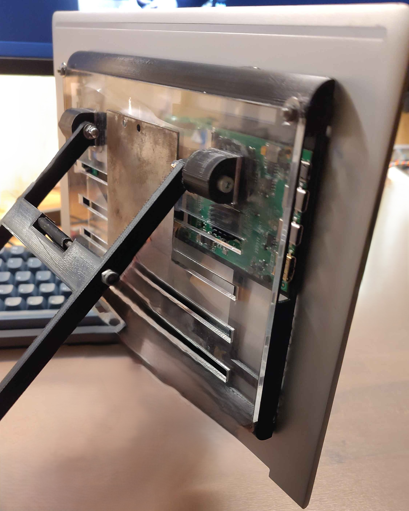

# Display recycling project


## About the project

This Repo explains the full process of how I learned 3D printing in order to give new life to an otherwise for parts only display. There were 2 generations, Generation 1 and it's contents have all the models for the first version I had created. Both carried the same idea with generation 2 obviously being an upgrade of the first. This was a simple design using both acrylic and 3d printing to create a thin and flat enclosure so it can be portable and still usable. The first generation was good but not quite at the level I had hoped to achieve. Therefore the redesign was started with generation 2, build learning from the mistakes I had made with generation 1. So that I could finally have the case I wanted to have all along something simple to install utilizing the original housing of the display. But also in a way that has minimal influence on the original housing. Otherwise this repo also contains all object files, 3MF's (but do beware the measurements are incorrect) and STL this is in case you wish to either edit, print or view the files on the repo. Also in the folder Fusioncode is a pythonscript that was made to export the files from the cloud back to the local disk for backing up.



## Generation 1

This project started when I was watching the video from [DIY Perks](https://www.youtube.com/watch?v=DrqdHVeBkp4). I was at the time impressed by the project and when I recieved the broken laptop display assembly I knew what had to be done. So fist part was discovering how it all would work, luckily the video explains this quite well so I will only recap the most important parts. The first step is to discover the display model number, this will allow is to find the correct driver board on ebay or make it if it does not exist. For me the display was the following number: **B133HAN04.B**, I was able to find this by checking all the stickers on the back on the [Panelook](https://www.panelook.com/) and seeing if they resulted into a match. That result gave me a few options to buy from from Ebay and after a order and a bit of waiting later all parts arrived safely I connected it all and tested if the display was still operational. 


**The display works now what?**

Well now that the display works the next step is to open up Fusion 360 and start designing and thinking of how the case should work. The main question that arose was how would I mount the board in a way that would have it stay inside the print? So a lot of measuring came into play this was to make sure that the placement of the screws was correct. Which ended up being incredibly challenging and since I did not own a 3D printed and wished the project to be done I chose to drill the holes through my print and make a simple rectangle for the IO since prototyping would be difficult. The screws ended up being plastic ones because they fit best inside the PCB and were non conductive so it would not be difficult to create a possible short. Then a simple acrylic panel was used as a lid to close the case up. This has some rectangular holes which theoretically would be used to loop a usb-c or mini hdmi cable so it would all be nice into one package (with ofc a big enough case with extra space to house the cable). 

Finally it was time for the most important part the system to keep the display setup at an angle so it remains stationary and easily adjustable. The original idea was to make hinges with screws since adjustments are easy and it would be easy to replicate. Then attached to those hinges are the legs with in the middle another alternative hinge. This middle hinge has another hinge on top of it which can be used to set a magnet head so the magnet always stays flat on the metal and so that adjustment is as simple as moving the magnet up or down. (This is a inbetween sidenote these choices were made with not a little to no experience with 3D printing and I did not have one available. I also was unaware of the practices I know now at the time of writing). With all of this done it was time to get on to the next step assembly of the case, board and the displayassembly. 

To start the assembly the display the display connector had to be found and then accurately cut so there is a passthrough for the cable to get to the back of the assembly. The print will help with this alignment since it also need a passthrough hole for the display cable making sure the cable is oriented in the correct way, this is so it can go back into the display driver PCB. Now that the cable is through the display assembly and slotted safely into the PCB driver board can be mounted inside the case near the rectangle so that drilling holes can be placed (making sure the driver board aligns well with the rectangular hole for the cable to pass through do the same for the input board). Once all the holes are made through the 3D case the screws can be inputted through the back so they stick out of the case so that screws match the pcb holes. Now the other screws to secure the acrylic can be placed and after that carefully place the pcb's and test that the holes line up the 3D case can be lined up with the display assembly and then glue it all shut. 


1. **Start the Game**: Players put on the Meta Quest 2/3 headset and enter the VR environment, where they are presented with the Bomkoffer.

2. **Solve Puzzles**: Players must interact with various components of the suitcase to solve puzzles and disable the bomb.

3. **Defuse the Bomb**: Successfully solving all puzzles within the time limit results in the bomb being defused.

4. **Game Over**: If the timer runs out or a mistake is made, the bomb explodes, and the game ends.

   (A more detailed version of the goal for operation can be found both in [flowchart](resources/flowchart1.png).)


## Tools and Technologies

- Unity Engine: The core platform for developing the VR game.

  - [Unity Documentation](https://docs.unity3d.com/Manual/index.html)

  - [Unity XR Plugin for Meta Quest 2/3](https://docs.unity3d.com/Manual/XR.html)

- Meta Quest 2/3

- Blender: For creating 3D models of the Bomkoffer and puzzle components.

  - [Blender Documentation](https://docs.blender.org/manual/en/latest/)

- Visual Studio: For scripting in C# within Unity.

  - [Visual Studio Documentation](https://learn.microsoft.com/en-us/visualstudio/?view=vs-2022)


## Key Components

- **Bomkoffer Model:** A detailed 3D model of the bomb suitcase, featuring interactive puzzle elements. For more details, check out the [Bomkoffer Research](research/Bomkoffer.md).  


- **Puzzle Mechanics:** Various puzzles integrated into the Bomkoffer, including wire cutting, code entry, and lever manipulation. This will be made with this idea that either the code from the real life counterpart can be converted into unity code. Or recreated versions fully inside unity with csharp. More on that [here](research/CppCsharpIntegration.md)
- **Timer System:** A countdown timer that adds urgency to the gameplay. For more details about interactive buttons and timers, check [here](research/buttonresearch.md).  


- Meta Quest 2/3 Interaction System: Hand tracking and object interaction using the Meta Quest 2/3 controllers.
- **World design and creation**: This is a readme dedicated to the creation of the map and lighting issues. More can be found [here](research/Lighting.md)


## Getting Started with unity


To get started with the **VR Game** project, follow these steps:

1. **Clone the Repository**:

   ```bash
   git clone https://github.com/PXLDigital/2EAI-PEN-2425-VRgame.git
   ```

2. **Open the Project in Unity**:
   - Ensure you have [Unity](https://unity.com/download) installed ( Unity 6 6000.0.38f1 )
   - Open the project folder in Unity.

3. **Install Required Packages**:
   - Import the **Oculus XR Plugin** from the [Unity Package Manager](https://docs.unity3d.com/Packages/com.unity.xr.oculus@0.8/manual/index.html).
   - Ensure all dependencies are installed via the Unity Package Manager.

4. **Run the Game**:
   - Connect your **Meta Quest 2/3** headset to your PC via Oculus Link or Air Link.
   - Press `Play` in Unity to start the game in VR mode.

5. **(Optional) Exporting the game to an APK file**:

   - Since this is a step mostly useful after project completion and it requires a bit more in depth of an explanation it can be found [here](research/S_ProjectToApkguide.md).


### Special Notes
- Ensure that the [Oculus App](https://www.meta.com/be/quest/setup/) is installed on your PC and that your Meta Quest 2/3 is properly set up for PC VR.


## Future Work

- **Multiplayer Mode**: Add a cooperative mode where two players can work together to defuse the bomb.
- **Additional Puzzles**: Introduce new puzzle types to increase variety and replayability.
- **Enhanced Graphics**: Improve the visual fidelity of the Bomkoffer and environment using advanced shaders and lighting techniques.
- **Standalone Meta Quest 2/3 Support**: Optimize the game to run natively on the Meta Quest 2/3 without requiring a PC.

- **One project one repo**: There will need to be a way to have one working project that everyone can utilize without issues. (Currently researched solutions work only a little to none or cause even weirder unexplainable issues.)


### Known Issues


- **Puzzle Difficulty Balancing**: Some puzzles may be too easy or too hard, requiring adjustments based on player feedback.
- **VR Motion Sickness**: Some players may experience discomfort due to rapid movements. Implementing comfort settings (e.g., snap turning) could help.
- **Working together on one project (i.e working on one project in a group on Github)**: A lot had to be figured out in order to get the Repo working correctly with no addition problems this includes a new system for working together and lot's of talks on how to best have a system. And even so it still shows issues also beware of viewing/checking changes on the online Repo when merging it may lag the computer and take long amounts of time to load or simply crash. Currently the best way to prevent this is perfect coordination within the team when making changes and dividing the workload so that team members never work on the same object or code at the same time. And it is also recommended to use a naming system to avoid merge conflicts on code. Among other Github issues.
- **Connection problems:** Sometimes the meta quest link app would fail this would often times just give a floating 3D meta quest logo or just even crash. (Currently a fix is to reinstall the program but it is not a guarantee this will remain.)
- **Big project size:** Even though Unity is suppose to be smaller it ends up being quite big even with only the needed files and assets.
- **Vigilance needed when building a project**: When building a project it is important to keep track of the Unity terminal for errors and warnings. It will look like it's building and seem busy but it may have stopped during a build without telling except for in the Unity terminal.
- **Backups are important:** Sometimes a clone will fail or there will be a weird unexplainable problem. This is not an issue but rather a recommendation to future work on this project to **ALWAYS HAVE A BACK UP BEFORE MERGING**. This will make figuring out what went wrong much easier and prevents loss of work.

## Results

* A decision was made to choose Unity instead of unreal engine 5 setup for this project a more detailed explanation can be found here => [unrealresearch.md](research/unrealresearch.md)
* Results for Demo 1 can be found [here](research/samenvattingDEMO1.md).


### Researched Topics

- **[Using C++ Modules in Unity](research/CppCsharpIntegration.md)**:  
  This research focuses on integrating C++ code, written with the Pico SDK, into Unity for simulation purposes. Testing software directly on the Raspberry Pi Pico can be time-consuming. By simulating the logic in a more user-friendly environment, debugging becomes faster and more efficient, ultimately saving time that would otherwise be spent troubleshooting on hardware.

- **[Unreal engine research](research/unrealresearch.md)**:  
  Research which outlines the benefits, challenges, and potential pitfalls of the engine. 

- **[Version Control for Large Projects](research/Version_Control.md)**:  
  Given the size of our project, we explored alternative solutions to Git. This research outlines the options we considered, along with a well-structured comparison of each. Ultimately, we decided to use Git LFS.


## Contributing

We welcome contributions from the community! Whether you want to report a bug, suggest a feature, or submit code, your input is valuable. Please check out our [contributing guidelines](.github/contributing.md) for more information on how to get involved.


## People

- **Dieter Vanrykel** - __TEACHER__ - [Vanrykel Dieter](https://github.com/Vanrykel)
- **Martijn Leemans** - __TEACHER__ - [Martijn Leemans](https://github.com/martijn-leemans)
- **Oliwier Jaworski** - __Student__ - [OliwierJaworski](https://github.com/OliwierJaworski)
- **Samy Warnants** - __Student__ - [SamyWarnants](https://github.com/SamyWarnants)
- **Ceyhan Yildiz** - __Student__ - [Ceyhan](https://github.com/CeyhanYildiz)
- **Thomas Fokkema** - __Student__ - [Thomas](https://github.com/RunningZeus5334)